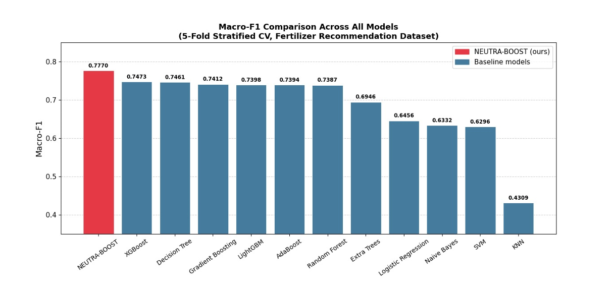
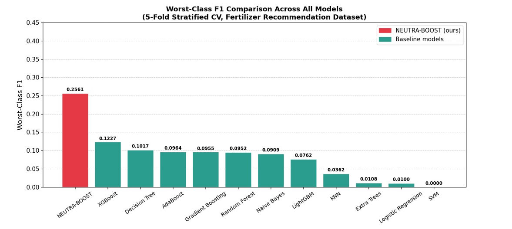
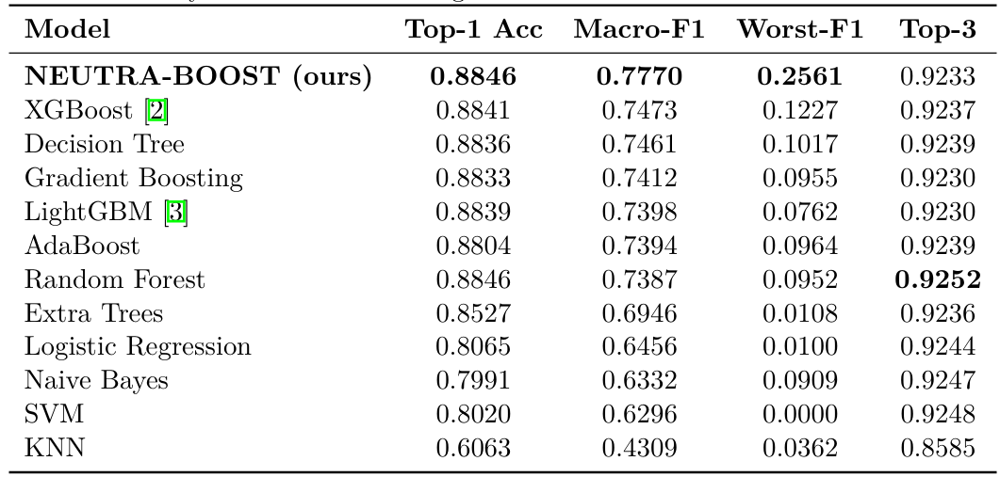
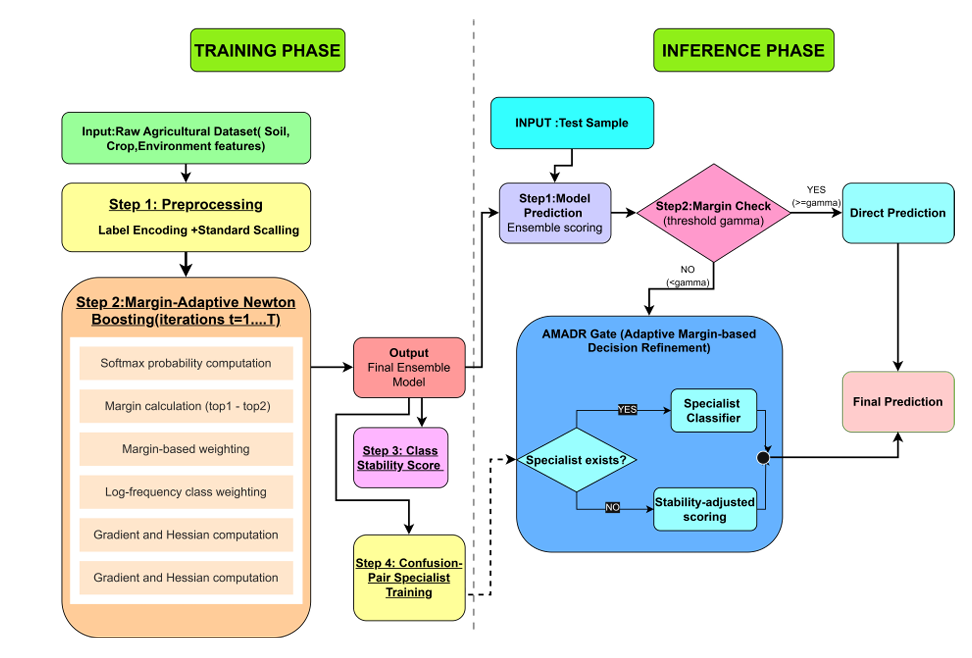

# NEUTRA-BOOST: Imbalanced Multiclass Boosting Framework
A novel boosting framework designed for highly imbalanced multiclass datasets, achieving significant improvements over state-of-the-art models such as XGBoost and LightGBM.
## Overview

NEUTRA-BOOST is a novel gradient boosting framework designed to address severe class imbalance in multiclass classification problems.

## Problem Statement

Traditional boosting methods struggle with minority class prediction in highly imbalanced datasets. NEUTRA-BOOST addresses this limitation through adaptive learning strategies.

## Key Results

* Evaluated on a 10,000-sample dataset with 17× class imbalance
* Achieved Macro-F1 = 0.777
* Outperformed:

  * XGBoost by +3.98%
  * LightGBM by +5.03%
 
* Improved worst-class F1 score by over 100%
 
## Performance Comparison

## Core Ideas (High-Level)

* Margin-adaptive sample weighting
* Class-aware gradient scaling
* Specialized handling of confusing class pairs
## System Overview

The framework follows a structured boosting pipeline:

Data → Preprocessing → Adaptive Boosting → Class-Aware Optimization → Predictions  

## Why It Matters

Handling class imbalance is critical in real-world systems such as agriculture, healthcare, and risk prediction. NEUTRA-BOOST improves reliability by ensuring minority classes are accurately predicted.
## Status

📄 Research work currently under review  
🔒 Detailed methodology and implementation withheld until publication

## Note

Detailed implementation and methodology are withheld until publication.

